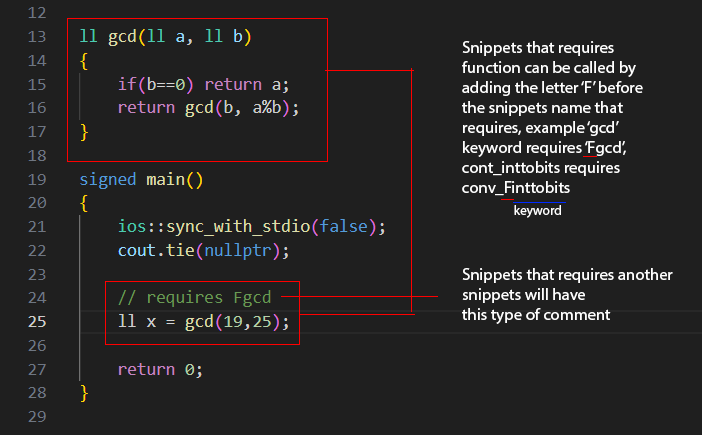

# Description
Thanks for trying out this extension <3. It was designed to help Competitive Programmers to get access to pre-made functions and codes easily for going fast during solving.
For more information or adding any issue, Go to the Github page below-

GitHub : https://github.com/101rakibulhasan/coderush-snippets 

Marketplace: https://marketplace.visualstudio.com/items?itemName=101rakibulhasan.coderush

# GENERAL IDEA

1. snippets are categorized into 3 parts-
    1. general = has no snippet type brfor keyword. They are just snippets. Example: vec, arr, tw
    2. conv = has "conv_" before keyword. This type converts one type to another type. Example: 'conv_inttobits' coverts int to bits
    3. gen = has "gen_" before keyword. this type generates certain output into another variable. Example: prime numbers etc gen_prime

2. Some Snippets requires its function to work, for example-

# PREFIXES
## FOR START CODE
1. init    -> Initialize C++ Main()
2. init-cp -> CP-Initialize C++ Main()

## FOR TESTCASES
3. tw    -> While-TestCase
4. tf    -> For-TestCase
5. twsv  -> While-TestCase with Special Value
6. tweof -> While-TestCase with EOF

## FOR VECTOR
7. prnt_vec -> Print Vector
8. vec      -> Initialize Vector

## FOR ARRAY
9.  prnt_Farr   -> Initialize Function For Printing 1D Array
10. prnt_arr    -> Print Array
11. arr         -> Initialize Array[size] With Input
12. arr_2d      -> Initialize 2D Array
13. prnt_arr_2d -> Print 2D Array

## FOR BASIC I/O
14. print -> Print COUT
15. scan  -> Get CIN

## FOR GENERATING
16. gen_Fprime -> Generate Prime Numbers Till N

    gen_prime  -> (vector) Initialize Prime Numbers Generator
17. gen_Fprimefactors -> (vector) Generates Prime Factors Function

    gen_primefactors  -> (vector) Initialize Prime Factors

## FOR CONVERSION
18. conv_inttobits -> Convert Int To Binary
19. conv_Fnumtostr -> (string) Convert Number to String Function

    conv_numtostr  -> (string) Convert Number to String
20. conv_Fstrtonum -> (ll) Convert String to Number Function

    conv_strtonum  -> (ll) Convert String to Number

## FOR ALGORITHMS
21. Fbs -> (vec,ll) Returns Index using Binary Search Function

    bs  -> (vec,ll) Returns Index using Binary Search
22. Fprime -> (ll) Returns 1 or 0 if Prime or Not

    prime  -> Initialize Prime Checker Variable
23. Fdfs -> DFS Function

    dfs  -> Initializes DFS
24. Fbfs -> BFS Function (bfs_nodes)

    bfs  -> (root,edge) BFS Initialize (bfs_nodes)
25. Fgcd -> GCD Function

    gcd  -> (ll) Returns GCD
26. Flcm -> (ll) LCM Function

    lcm  -> (ll) Returns the LCM Number
27. Fpower -> (base^upper) Power Function

    power  -> Do Power (base^powervar)
28. Flcs -> Longest Common Subsequence Length Function

    lcs  -> Longest Common Subsequence Length Between two strings

29. Fbe -> Binary Exponent Function

    be  -> Initialize Binary Exponent Function

30. Fme -> Modular Exponentiation Function

    me  -> Initilaize Modular Exponentiation Function

## Data Structures
31. olist -> Initialize Ordered List

